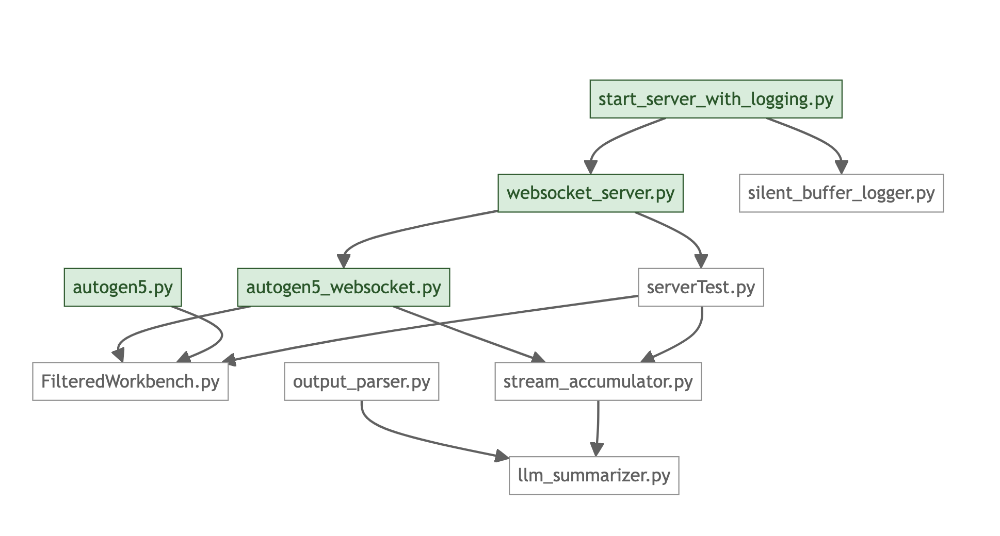

# AutoGen Multi-Agent System and WebSocket Server

Here we have all the components that create the multi-agent system. The top logic for the agent systems are in the `autogenX.py` files, where X denotes the version of the system. Currently, we are developing the 5th iteration of the multi-agent system.

Here are the other files that make the multi-agent system work:

- `autogenX_websocket`: Is a copy of `autogenX`, but serves the output through a WebSocket and not to the terminal
- `start_server_with_logging`: Starts the `autogenX_websocket` with silent logging activated for debugging purposes. The logs can then be found in the `logs/` directory
- `websocket_server`: The actual websocket server streaming the agents' output, that is then being wrapped around by `start_server_with_logging`

### Helper & Utilites

This diagram shows the dependencies the above files have on the `helper` files:

The `/util` files contain similar functions as in the MCP server, mostly parsing and client handling.

### Secrets

A global usage of secrets is still not yet implemented. You need to create the same secrets.ini file as in the parent directory.